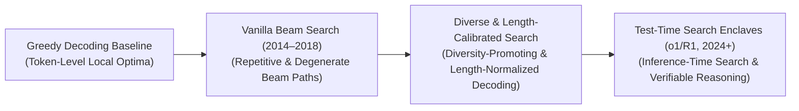
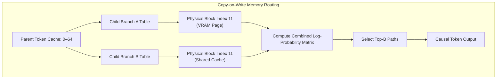

# Awesome-Beam-Search
## Beam Search in AI: History, Progression, Variants, & Applications

Beam Search is a heuristic, graph-traversal search algorithm that optimizes sequential decision-making and token-decoding pipelines in Artificial Intelligence. Used extensively across Natural Language Processing (NLP), sequence-to-sequence translation, and speech-to-text systems, Beam Search operates between the high computational cost of an exhaustive **Breadth-First Search (BFS)** and the structural shortsightedness of a **Greedy Decoding** routine. 

Instead of tracking all alternative sequence paths or selecting only the single highest-probability token at each index step, Beam Search maintains a fixed-capacity number ($B$, known as the **Beam Width**) of the absolute highest scoring candidate sequences concurrently. At each sequential token milestone, it expands all $B$ paths, computes their combined conditional log-probabilities, and prunes the exploration grid to retain only the top $B$ paths, balancing token diversity with real-world computational efficiency.

---

## 1. The Macro Chronological Evolution

The implementation of sequential sequence search has transitioned from rigid heuristic lookaheads to deep neural sequence alignments, memory-pinned parallel trees, and native reinforcement-learned verification loops.

| Concept / Era | Key Characteristics & Evolution | First Used Year | First Used Paper |
| :--- | :--- | :--- | :--- |
| [**The Token-Level Intuition Era (Greedy Decoding Baseline)**](details/greedy_decoding.md) | **Concept:** The entry-level sequence standard. The decoder outputs text by blindly selecting the absolute highest-probability token at step $t$, instantly feeding that token ID into the context window for step $t+1$. **Limitation:** Easily trapped in local minima. Selecting a high-probability token early on can inadvertently route the model into an absolute dead-end path where all subsequent tokens possess low structural probability, ruining long-range sentence cohesion. | 1948 | [Shannon (1948)](https://ieeexplore.ieee.org/document/6773024) |
| [**The Neural Sequence Unrolling Era (Vanilla Beam Search, ~2014–2018)**](details/vanilla_beam_search_era.md) | **Concept:** Standardized during the rise of Recurrent Neural Networks (RNNs) and early sequence-to-sequence machine translation (e.g., Bahdanau attention baselines). At each chronological index, the algorithm unrolls the cumulative conditional log-probabilities across the vocabulary matrix, tracking a rigid, parallel pool of $B$ paths. **Limitation:** Susceptible to **structural degeneracy**. Standard beam search displays an aggressive mathematical tendency to collapse into repetitive loops, producing monotone, robotic text paths because it over-indexes on high-frequency, safe vocabulary tokens. | 2014 | [Sutskever et al. (2014)](https://arxiv.org/abs/1409.3215) |
| [**The Diversity, Penalty, & Length Calibration Era (~2018–2023)**](details/diversity_length_calibration.md) | **Concept:** Restructured beam search trajectories using customized mathematical constraints and behavioral penalties. Algorithms like **Diverse Beam Search (DBS)** partitioned the beam pool into independent structural groups, penalizing overlapping tokens between groups to force alternative paths. Concurrently, **Length Normalization** coefficients were introduced to prevent the mathematical decay of log-probabilities from systematically biasing search results toward short, incomplete sentences. | 2016 | [Wu et al. (2016)](https://arxiv.org/abs/1609.08144) / [Vijayakumar et al. (2016)](https://arxiv.org/abs/1610.02424) |
| [**The Test-Time Search & Programmatic Verification Era (~2024–Present)**](details/test_time_search.md) | **Concept:** The current modern state-of-the-art foundation standard driving advanced reasoning architectures (such as OpenAI's o-series and DeepSeek-R1). It ports beam search out of superficial text-generation pipelines and straight into hard, non-neural **System 2 thinking blocks**. The model generates a tree of alternative logical steps, pairing beam traversal with **Monte Carlo Tree Search (MCTS)** or sandboxed compilers to prune away uncompilable or logically flawed thought tracks dynamically. | 2024 | [OpenAI o1 (2024)](https://openai.com/news/learning-to-reason-with-llms/) / [DeepSeek-R1 (2025)](https://arxiv.org/abs/2501.12948) |

---

## 2. Core Functional & Algorithmic Search Variants

The Beam Search family tree features specialized architectural modifications engineered to balance vocabulary exploration breadth with structural constraint satisfaction.

| Variant | Mechanism & Characteristics | First Used Year | First Used Paper |
| :--- | :--- | :--- | :--- |
| [**Vanilla Beam Search (Cumulative Log-Likelihood)**](details/vanilla_beam_search.md) | **Mechanism:** Maximizes the strict summation of conditional token log-probabilities over a fixed beam width $B$: $$\text{Score}(Y) = \sum_{t=1}^{T} \log P(y_t \mid y_{<t}, X)$$ **Behavior:** Tracks the highest joint probability paths deterministically, but is prone to repetitive content loops if optimized unconstrained. | 1976 | [Lowerre (1976)](https://dx.doi.org/10.1121/1.2003310) |
| [**Diverse Beam Search (DBS)**](details/diverse_beam_search.md) | **Mechanism:** Partitions the $B$ available beams into $G$ independent structural groups. When expanding a path, it injects a **diversity penalty term** that mathematically de-values any token candidate that highly overlaps with tokens actively selected by parallel groups. **Pros:** Forces the model to explore completely different grammatical framings, vocabulary styles, or logical hypotheses concurrently, preventing structural monoculture. | 2016 | [Vijayakumar et al. (2016)](https://arxiv.org/abs/1610.02424) |
| [**Constrained / Lexical Beam Search**](details/constrained_beam_search.md) | **Mechanism:** Imposes rigid, non-negotiable text token requirements on the decoding sequence. The search tree forces specific keywords, entity names, or API function arguments to be present within the path, pruning away any candidate branch that violates those boundary conditions. **Application:** Essential for enterprise tool-augmentation tasks matching strict backend schemas. | 2017 | [Hokamp & Liu (2017)](https://arxiv.org/abs/1704.07138) |
| [**Lookahead / Speculative Beam Decoding**](details/speculative_beam_decoding.md) | **Mechanism:** Pairs a compact, low-parameter draft network with a massive target model. The draft model runs rapid multi-step beam lookaheads, while the target model verifies the complete tree branch simultaneously in a single, parallelized matrix multiplication pass. | 2023 | [Leviathan et al. (2023)](https://arxiv.org/abs/2211.17191) / [Qin et al. (2024)](https://arxiv.org/abs/2405.10543) |

---

## 3. The Beam Search Caching & Routing Matrix

To execute multi-path tree unrolling without hitting GPU hardware walls, the runtime engine leverages optimized virtual block tables and memory-sharing mechanisms.

| Architecture Component | Profile / Description | First Used Year | First Used Paper |
| :--- | :--- | :--- | :--- |
| [**Copy-on-Write Page Sharing (vLLM integration)**](details/copy_on_write_page_sharing.md) | **Profile:** Slashes memory overhead during branching searches. When beam search forks into alternative candidate paths, the child branches do not duplicate the historical Key-Value (KV) cache. Instead, they share identical pointers to the parent memory blocks, allocating new physical memory blocks natively only when a branch writes a distinct token ID. | 2023 | [Kwon et al. (2023)](https://arxiv.org/abs/2309.06180) |
| [**Logit Bias Modifier Layers**](details/logit_bias_modifier.md) | **Profile:** Intercepts sampling outputs. The beam search infrastructure tracks token distributions at runtime, dynamically injecting penalty variables or scalar scaling offsets directly into the unnormalized log-odds vectors right before decoding choices freeze. | 2019 | [Radford et al. (2019)](https://cdn.openai.com/better-language-models/language_models_are_unsupervised_multitask_learners.pdf) |

---

## 4. Production Engineering Challenges & Hardware Solutions

Deploying multi-path beam search decoding over large-scale cloud-serving infrastructures introduces severe computing and memory bottlenecks.

| Engineering Challenge | Problem & Mitigation | First Used Year | First Used Paper |
| :--- | :--- | :--- | :--- |
| [**The Key-Value (KV) Cache VRAM Satiation Wall**](details/kv_cache_satiation.md) | **The Problem:** Maintaining $B$ separate, active candidate sequences across a long context length forces the system to cache massive, multi-gigabyte Key-Value attention tensors concurrently. This quickly saturates GPU High Bandwidth Memory (HBM), leading to severe memory fragmentation and cluster-wide Out-of-Memory crashes. **Mitigation:** Implementing **PagedAttention virtual memory allocation** to store cache blocks non-contiguously, combined with **Grouped-Query Attention (GQA)** to compress the scale of the active attention matrices. | 2023 | [Kwon et al. (2023)](https://arxiv.org/abs/2309.06180) |
| [**The Thread Synchronization and Silicon Underutilization Stagnation**](details/thread_sync_underutilization.md) | **The Problem:** Beam search requires a hard synchronization checkpoint at the end of every token step: all candidate paths must finish computing their logits before the top $B$ elements can be sorted and selected. This creates constant thread barriers that prevent GPUs from maximizing tensor core execution parallelization. **Mitigation:** Compiling the top-$K$ selection, index translation, and logit sorting functions straight into a single **fused Triton or CUDA kernel block**, performing the math entirely within fast on-chip GPU SRAM registers to bypass global memory bus latency. | 2022 | [Dao et al. (2022)](https://arxiv.org/abs/2205.14135) |

---

## 5. Frontier Real-World AI Industrial Applications

| Industrial Application | Application Context & Implementation | First Used Year | First Used Paper |
| :--- | :--- | :--- | :--- |
| [**Native Inference-Time Search for Advanced Reasoning Models**](details/inference_time_search_models.md) | **Application:** Forms the baseline optimization engine driving System 2 thinking models (such as OpenAI's o-series and DeepSeek-R1). Modified beam search routines traverse complex mathematical proofs and coding logic tracks, using process reward value networks to guide branching exploration paths precisely. | 2024 | [OpenAI o1 (2024)](https://openai.com/news/learning-to-reason-with-llms/) / [DeepSeek-R1 (2025)](https://arxiv.org/abs/2501.12948) |
| [**High-Volume Enterprise Machine Translation Pipelines**](details/machine_translation_pipelines.md) | **Application:** Powers commercial cross-lingual serving infrastructures. Diverse and length-normalized beam search allows translation networks to evaluate multiple complex syntax alignments simultaneously, outputting highly natural, contextually accurate phrasing across localized languages. | 2016 | [Wu et al. (2016)](https://arxiv.org/abs/1609.08144) |
| [**Automated Continuous Voice Recognition & Telemetry (Speech-to-Text)**](details/voice_recognition_telemetry.md) | **Application:** Processes continuous, high-frequency acoustic streams natively. Real-time beam search modules ingest sequential audio token embeddings, tracking multiple competing phonetic hypotheses concurrently to decode clear text scripts under noisy background environments stably. | 1976 | [Lowerre (1976)](https://dx.doi.org/10.1121/1.2003310) |

---

## References
1. Bahdanau, D., Cho, K., & Bengio, Y. (2014). Neural machine translation by jointly learning to align and translate. *arXiv preprint arXiv:1409.0473*.
2. Sutskever, I., Vinyals, O., & Le, Q. V. (2014). Sequence to sequence learning with neural networks. *Advances in Neural Information Processing Systems (NeurIPS)*, 27.
3. Vijayakumar, A. K., et al. (2016). Diverse beam search: Decoding diverse solutions from neural sequence models. *arXiv preprint arXiv:1610.02424*.
4. Hokamp, C., & Liu, Q. (2017). Lexically constrained decoding for sequence-to-sequence generation. *Proceedings of the 55th Annual Meeting of the Association for Computational Linguistics*, 1535-1546.
5. Kwon, W., et al. (2023). Efficient memory management for large language model serving with pagedattention. *Proceedings of the 29th Symposium on Operating Systems Principles (SOSP)*.
6. DeepSeek-AI. (2025). DeepSeek-R1: Incentivizing reasoning capability in foundational language transformers via large-scale self-play reinforcement learned test-time beam search tracks. *GitHub Repository Technical Infrastructure Manifesto*.

---

To advance this documentation repository, search-tree blueprint, or MLOps automation pipeline, consider exploring these adjacent development pathways:
* Build a **Python script using PyTorch** illustrating how to construct a manual Beam Search decoding loop that manages cumulative log-probabilities and token index tracking matrices over a small vocabulary.
* Generate a **comprehensive Markdown table** explicitly comparing Greedy Decoding, Random Sampling, Vanilla Beam Search, Diverse Beam Search (DBS), and Monte Carlo Tree Search (MCTS) across time complexities, VRAM cache tracking profiles, susceptibility to repetitive loops, and suitability for open-ended creative tasks versus closed-box logic tasks.
* Establish a **performance evaluation harness using Triton** to profile exactly how compiling a fused top-$K$ selection step directly into fast GPU registers alters the overall wall-clock token generation throughput of high-concurrency cloud serving nodes.

***

**Contextual Related Topics:**

To optimize your systemic overview of cognitive traversal and post-training infrastructure optimization, explore these adjacent documentation sets:
* To see how search trajectories are scaled natively inside hidden parameters, review **[Test-Time Computation in AI](#)**.
* To master the memory-paging frameworks that share cache blocks across child paths, check out **[PagedAttention Implementations](#)**.
* To audit the internal hidden neurons that generate the token log-probabilities used during traversal, read **[Sparse Autoencoders (SAEs) for Interpretability](#)**.

