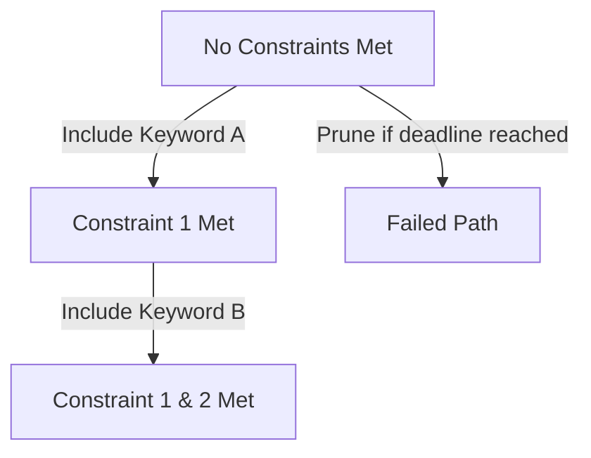

# Constrained / Lexical Beam Search

Constrained Beam Search enforces the inclusion of specific target words or phrases (lexical constraints) in the output.

## Strategy
- Maintain grid states tracking how many constraints have been satisfied.
- Prune paths that cannot satisfy remaining constraints in remaining tokens.

## Grid Tracking Diagram

[Back to README](../README.md)
