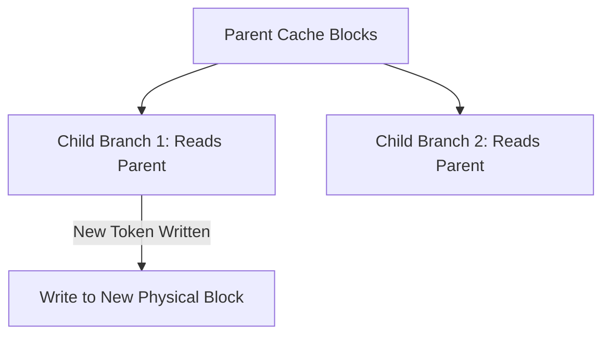

# Copy-on-Write Page Sharing

Copy-on-Write (CoW) page sharing optimizes the Key-Value (KV) cache memory footprints when beams branch.

## Mechanism
- Child branches share identical pointers to historical KV cache blocks.
- Memory block replication occurs only when a branch produces diverging tokens.

## Virtual Memory Diagram

[Back to README](../README.md)
