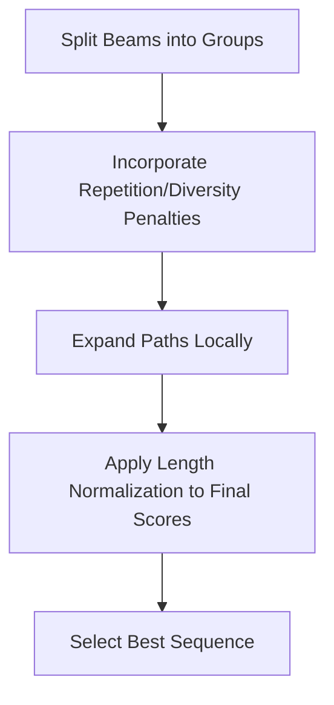

# The Diversity, Penalty, & Length Calibration Era

As NLP progressed, standard beam search proved too repetitive and short-biased. Researchers introduced diverse search groupings and length normalization parameters.

## Core Adjustments
- **Diverse Beam Search (DBS):** Splitting beams into independent groups and applying a diversity penalty for cross-group token repetition.
- **Length Normalization:** Rescaling the score by dividing by a function of sequence length to ensure longer sequences are not unfairly penalized:
  $$\text{Score}(Y) = \frac{\sum_{t=1}^{T} \log P(y_t \mid y_{<t}, X)}{L(T)}$$

## Process Diagram

[Back to README](../README.md)
