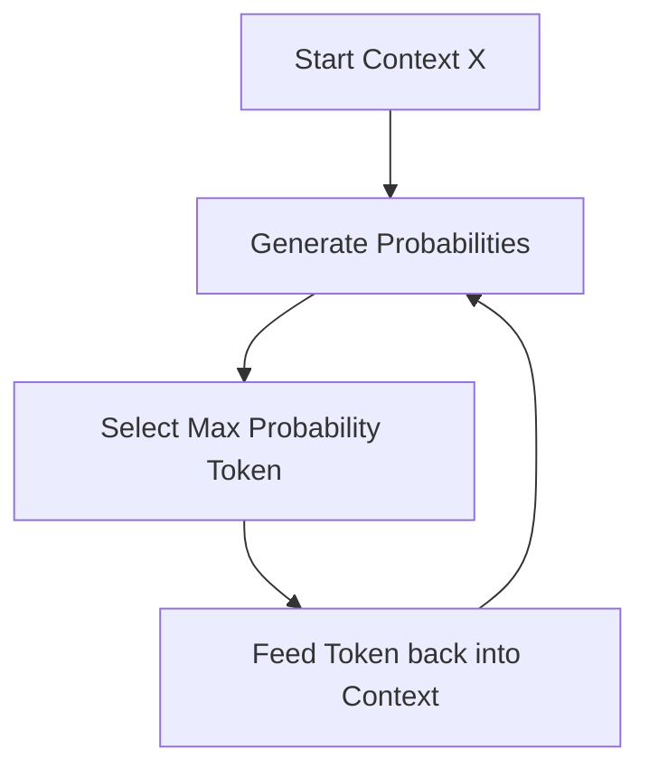

# Greedy Decoding

Greedy decoding is the simplest sequence generation strategy in natural language processing and sequence-to-sequence models. At each decoding step, the model selects the token with the absolute highest probability.

## How It Works
1. At step $t$, the decoder generates a probability distribution over the entire vocabulary.
2. The token $y_t$ with the maximum probability is selected:
   $$y_t = \arg\max_{w} P(w \mid y_{<t}, X)$$
3. This token is fed back into the context window as input for step $t+1$.

## Advantages
- **Fast:** Extremely low computational complexity ($O(1)$ search overhead).
- **Simple:** No backtracking or state tracking needed.

## Disadvantages / Limitations
- **Local Optima:** Greedy decoding does not consider the long-term impact of its choice. A token that looks optimal at step $t$ might lead to a sequence of very low-probability tokens later on.
- **Lack of Diversity:** Often produces repetitive, generic, or short outputs.

## Architecture Diagram

[Back to README](../README.md)
