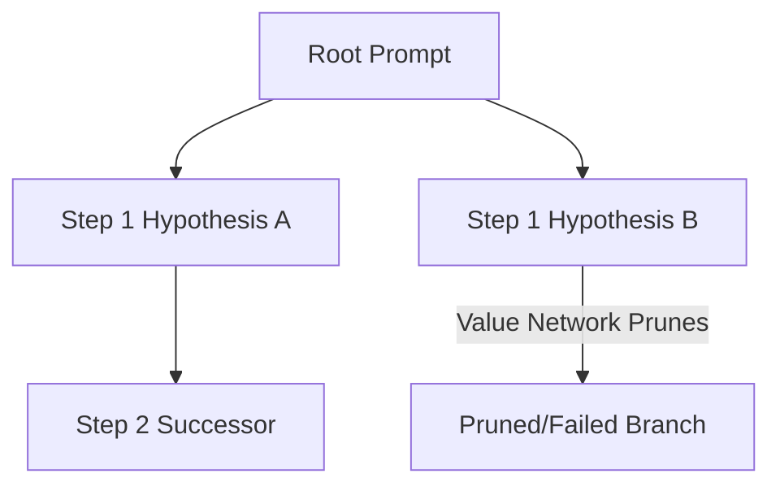

# Native Inference-Time Search for Advanced Reasoning Models

Modern reasoning frameworks perform multi-path reasoning steps natively at inference time using self-correction and process reward feedback.

## Process
- Generates logical nodes.
- Traverses code execution or proof verification paths.
- Uses value networks to estimate the likelihood of reaching a correct answer.

## Search Tree Diagram

[Back to README](../README.md)
