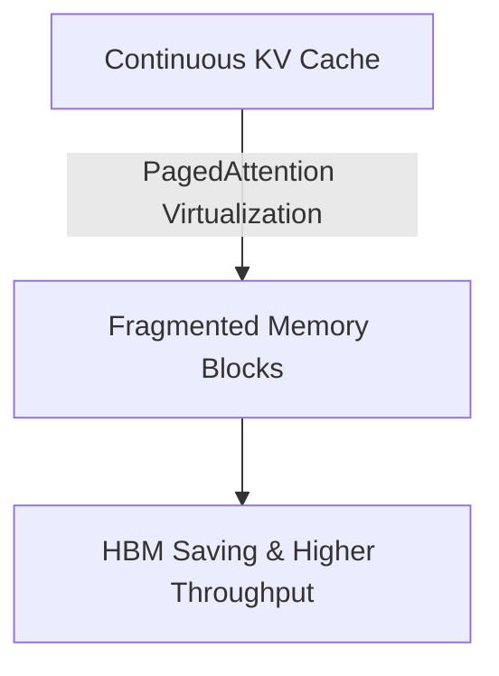

# The Key-Value Cache VRAM Satiation Wall

Long-context generation combined with large beam widths requires storing massive KV cache tensors, saturating GPU high bandwidth memory (HBM).

## Solutions
- **PagedAttention:** Virtualizing the KV cache to eliminate external fragmentation.
- **Grouped-Query Attention (GQA):** Reducing the query head size compared to key-value heads.

## Memory Mitigation Diagram

[Back to README](../README.md)
