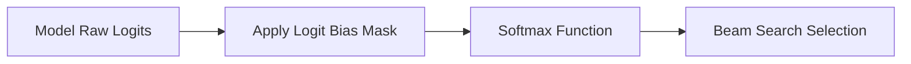

# Logit Bias Modifier Layers

Logit Bias Modifier Layers dynamically intercept language model outputs by adding scalar penalties or rewards to logits before sampling.

## Equation
$$\tilde{z}_i = z_i + \text{bias}_i$$

## Interaction Diagram

[Back to README](../README.md)
