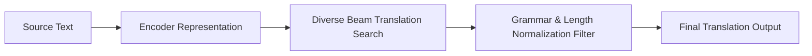

# High-Volume Enterprise Machine Translation Pipelines

Cross-lingual translation requires diverse decoding strategies to capture local linguistic context and syntax structures.

## Strategy
- Length-normalized diverse beam search to generate natural and accurate translated text.
- Real-time sentence validation to output correct phrasing.

## Pipeline Diagram

[Back to README](../README.md)
