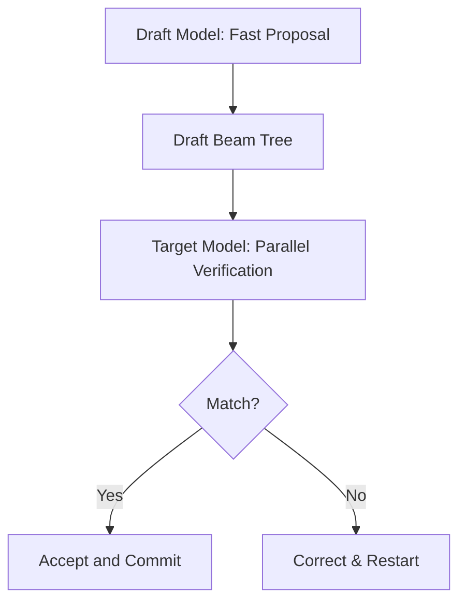

# Lookahead / Speculative Beam Decoding

Speculative Beam Decoding uses a smaller, faster draft model to propose beams and uses the target model to verify them in parallel.

## Workflow
1. Draft model unrolls multiple steps of beam search to produce a candidate tree.
2. Target model evaluates the tree in a single matrix-multiplication pass.
3. Accepted tokens are committed, and failed branches are discarded.

## Verification Pipeline Diagram

[Back to README](../README.md)
