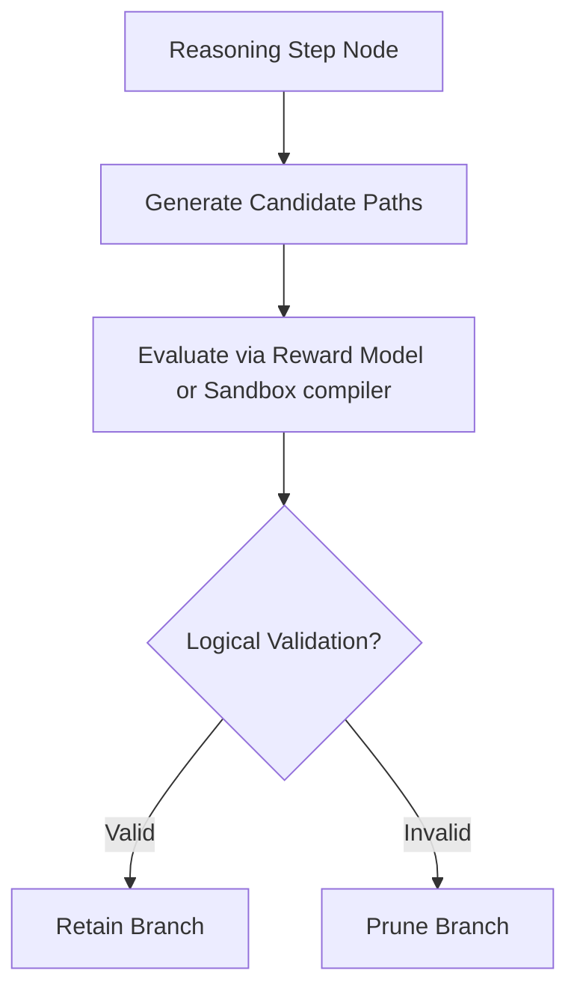

# The Test-Time Search & Programmatic Verification Era

Modern reasoning models (e.g., OpenAI o1, DeepSeek-R1) shift beam search from surface-level token selection to "System 2" reasoning structures, executing searches over logic steps.

## Key Aspects
- **System 2 Thinking:** Tree-of-Thought search models evaluating step-by-step reasoning paths.
- **Monte Carlo Tree Search (MCTS):** Balancing exploration and exploitation of logical thoughts.
- **Programmatic Verification:** Compiling code or checking proofs in sandboxed environments to prune incorrect paths.

## Reasoning Loop Diagram

[Back to README](../README.md)
