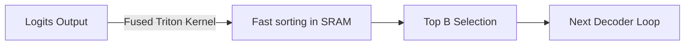

# Thread Synchronization and Silicon Underutilization

Sorting and selecting top $B$ candidates at each token step creates thread barriers on GPUs, reducing compute efficiency.

## Solutions
- Fusing logit collection, sorting, and index mapping into CUDA/Triton kernels.
- Minimizing data transfers to global GPU memory by keeping beam state in SRAM registers.

## Execution Flow Diagram

[Back to README](../README.md)
