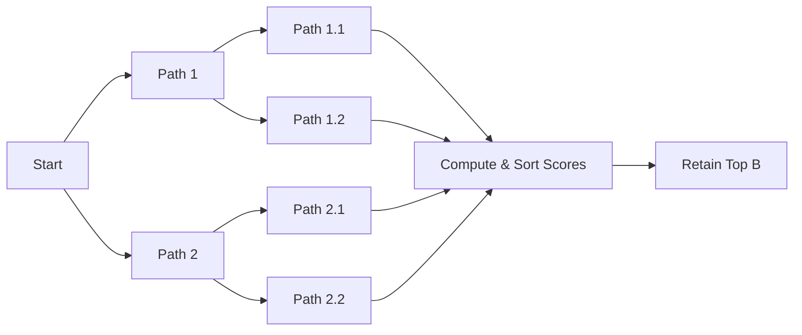

# Vanilla Beam Search

Vanilla Beam Search is a classical heuristic graph search algorithm that maintains a set of $B$ best candidate paths at any point in sequence decoding.

## Score Formulation
$$\text{Score}(Y) = \sum_{t=1}^{T} \log P(y_t \mid y_{<t}, X)$$

## Mechanics
- Tracks exact joint probabilities.
- Deterministic and local-context sensitive.

## Process Diagram

[Back to README](../README.md)
