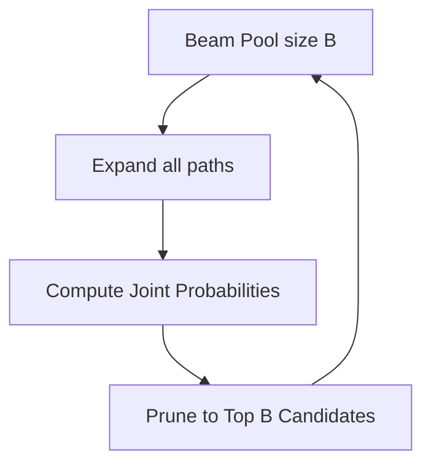

# The Neural Sequence Unrolling Era

During the rise of sequence-to-sequence architectures (RNNs, LSTMs, and early Transformers) between 2014 and 2018, Vanilla Beam Search became the standard method for decoding sequences.

## How It Works
1. Instead of tracking a single path (like Greedy Decoding), standard beam search maintains a pool of $B$ (beam width) candidate sequences.
2. At each step, all $B$ sequences are expanded.
3. The joint probability of all expanded paths is computed.
4. The top $B$ paths with the highest cumulative log-probability are kept, and the rest are pruned.

## Key Limitations
- **Structural Degeneracy:** Aggressive repetition loop behavior.
- **Length Bias:** Mathematically biases search results toward shorter sequences because log-probabilities are negative numbers (summing them over more steps yields smaller numbers).

## Flow Diagram

[Back to README](../README.md)
