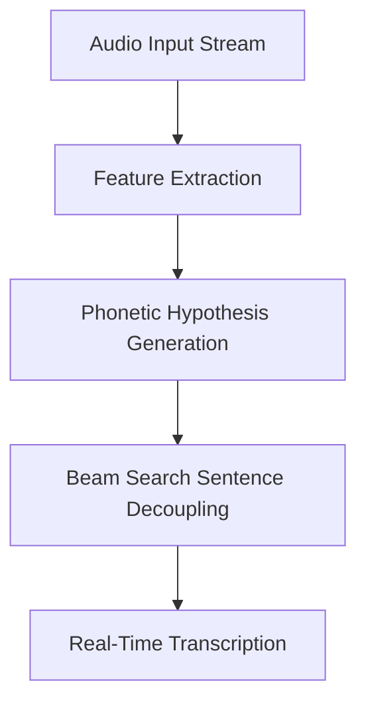

# Automated Continuous Voice Recognition & Telemetry

Acoustic sequence models process continuous audio tokens by tracking multiple competing phonetic tracks in real-time.

## System
- Integrates acoustic features with vocabulary probability grids.
- Updates candidate hypotheses dynamically at low latencies.

## Telemetry Flow Diagram

[Back to README](../README.md)
